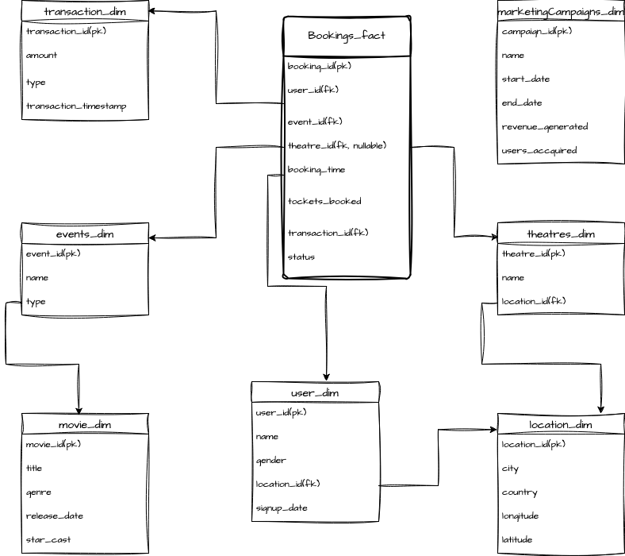
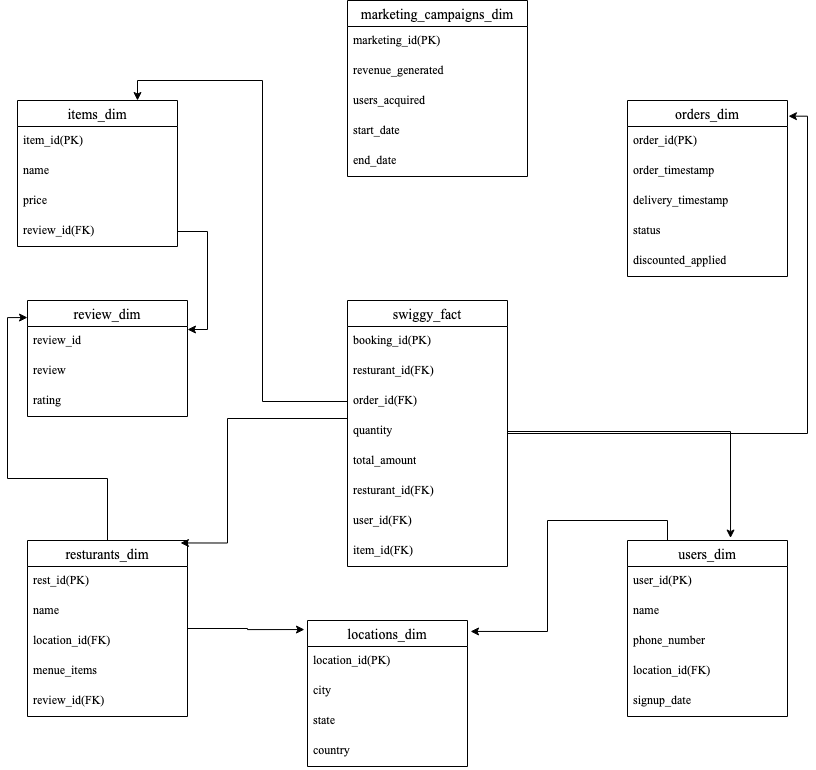
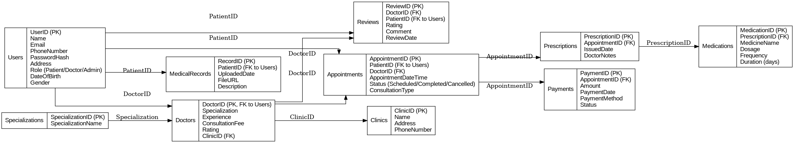

# **
    Data Modeling**


## DATA MODEL DIAGRAM (BookMyShow)




## Tables

-- 1. Users (user_id, name, gender, signup_date, location_id)
-- 2. Locations (location_id, city,country, latitude, longitude)
-- 3. Movies (movie_id, title, genre, release_date, star_cast)
-- 4. Theatres (theatre_id, name, location_id)
-- 5. Events (event_id, title, type, location_id)
-- 6. Bookings (booking_id, user_id, theatre_id, event_id, booking_time, ticket_count,transaction_id, status)
-- 7. marketCampaigns (campaign_id, name, start_date, end_date, target_audience, revenue_generated)
-- 8. Transacrion (transaction_id, amount, type, transaction_timestamp)

## Questions

```sql
-- 1. Most popular movie genres in specific locations
SELECT
    l.city,
    m.genre,
    COUNT(b.booking_id) AS booking_count
FROM
    Bookings b
JOIN
    Events e ON b.event_id = e.event_id
JOIN
    Movies m ON e.movie_id = m.movie_id
JOIN
    Theatres t ON b.theatre_id = t.theatre_id
JOIN
    Locations l ON t.location_id = l.location_id
WHERE
    b.status = 'CONFIRMED'
GROUP BY
    l.city, m.genre
ORDER BY
    booking_count DESC;

-- 2. Busiest time of the day/week for movie bookings
SELECT
    EXTRACT(DAY FROM b.booking_time) AS booking_day,
    EXTRACT(HOUR FROM  b.booking_time) AS booking_hour,
    COUNT(b.booking_id) AS booking_count
FROM
    Bookings b
WHERE
    b.status = 'CONFIRMED'
GROUP BY
    EXTRACT(DAY FROM b.booking_time) ,
    EXTRACT(HOUR FROM  b.booking_time) 
ORDER BY
    booking_count DESC;

-- 3. Percentage of customers who book tickets for other events after movies
WITH movie_bookers AS (
    SELECT DISTINCT user_id
    FROM Bookings
    WHERE movie_id IS NOT NULL AND status = 'CONFIRMED'
),
event_bookers AS (
    SELECT DISTINCT user_id
    FROM Bookings
    WHERE event_id IS NOT NULL AND status = 'CONFIRMED'
)
SELECT
    (COUNT(eb.user_id) * 100.0 / COUNT(mb.user_id)) AS percentage_event_bookers
FROM
    movie_bookers mb
LEFT JOIN
    event_bookers eb ON mb.user_id = eb.user_id;

-- 4. Average number of tickets booked per transaction
SELECT
    AVG(b.ticket_count) AS avg_tickets_per_transaction
FROM
    Bookings b
WHERE
    b.status = 'CONFIRMED';

-- 5. Rate of booking cancellations
SELECT
    (COUNT(CASE WHEN b.status = 'CANCELLED' THEN 1 END) * 100.0 / COUNT(b.booking_id)) AS cancellation_rate
FROM
    Bookings b;

-- 6. Impact of pricing on booking volume
SELECT
    FLOOR(b.total_price / b.ticket_count) AS price_per_ticket,
    COUNT(b.booking_id) AS booking_volume
FROM
    Bookings b
WHERE
    b.status = 'CONFIRMED'
GROUP BY
    FLOOR(b.total_price / b.ticket_count)
ORDER BY
    price_per_ticket;

-- 7. Correlation between star cast and movie bookings
SELECT
    m.star_cast,
    COUNT(b.booking_id) AS booking_count
FROM
    Bookings b
JOIN
    Movies m ON b.movie_id = m.movie_id
WHERE
    b.status = 'CONFIRMED'
GROUP BY
    m.star_cast
ORDER BY
    booking_count DESC;

-- 8. Number of new users acquired each month
SELECT
    EXTRACT(MONTHYEAR FROM u.signup_date) AS signup_month,
    COUNT(u.user_id) AS new_users
FROM
    Users u
GROUP BY
    EXTRACT(MONTHYEAR FROM u.signup_date)
ORDER BY
    signup_month;

-- 9. Most effective marketing campaigns
SELECT
    c.name AS campaign_name,
    COUNT(uc.user_id) AS users_acquired,
    c.revenue_generated
FROM
    Campaigns c
LEFT JOIN
    UserCampaigns uc ON c.campaign_id = uc.campaign_id
GROUP BY
    c.name, c.revenue_generated
ORDER BY
    c.revenue_generated DESC, users_acquired DESC;

-- 10. Revenue generated from each movie theatre
SELECT
    t.name AS theatre_name,
    SUM(b.total_price) AS total_revenue
FROM
    Bookings b
JOIN
    Theatres t ON b.theatre_id = t.theatre_id
WHERE
    b.status = 'CONFIRMED'
GROUP BY
    t.name
ORDER BY
    total_revenue DESC;
```


## DATA MODEL DIAGRAM (Zomato/Swiggy)



## Tables

-- 1. Users (user_id, name, phone_number, signup_date, location_id)
-- 2. Locations (location_id, city,country, state)
-- 3. Resturants (rest_id, title, name, review_id, menue_items)
-- 4. Reviews (review_id, review, rating)
-- 5. Items (item_id, name, price, rating_id)
-- 6. swiggy (booking_id, user_id, resturant_id, order_id, quantity, total_amount,item_id,quantity)
-- 7. marketing_campaigns (campaign_id, name, start_date, end_date, target_audience, revenue_generated)
-- 8. Orders (order_id, status, order_timestamp,delivery_timestamp)

## Questions

```sql
-- 1. The most popular restaurants in specific locations.
SELECT 
 r.name AS Resturant_name
 ,l.city AS Location_city 
 ,COUNT(b.booking_id) AS most_ordered
FROM Swiggy b 
JOIN Resturants r ON b.resturant_id = r.rest_id 
JOIN Locatins l ON l.location_id = r.location_id
JOIN Orders o ON b.order_id = o.order_id
WHERE o.status = 'DELIVERED'
GROUP BY r.name , l.city
ORDER BY most_ordered;
-- 2. The busiest times of day/week for food orders.
SELECT 
 EXTRACT(DAY FROM o.order_timestamp) AS order_day
 ,EXTRACT(WEEK FROM o.order_timestamp) AS order_week
 ,COUNT(b.booking_id) AS booking_total
FROM swiggy b 
JOIN Orders o ON b.order_id = o.order_id
WHERE o.status = 'DELIVERED'
GROUP BY 
   EXTRACT(DAY FROM o.order_timestamp) 
 ,EXTRACT(WEEK FROM o.order_timestamp) 
ORDER BY booking_total DESC;
-- 3. The average order value for each customer.
SELECT 
 u.name AS User_name 
 ,ROUND(AVG(b.total_amount - o.discount_applied),2)  AS Average_amount
FROM swiggy b 
JOIN Users u ON b.user_id = u.user_id
JOIN Orders o ON o.order_id = b.order_id
WHERE o.status = "DELIVERD"
GROUP BY u.name;
-- 4. The average delivery time for each restaurant and/or delivery personnel.
SELECT 
 r.name AS resturant_name 
 ,AVG(TIMESTAMPDIFF(MINUTE, order_timestamp, delivery_timestamp)) AS MinutesDifference
FROM swiggy b 
JOIN Orders o on b.order_id = o.order_id
JOIN Resturants r b.resturant_id = r.rest_id
WHERE o.status = 'DELIVERD'
GROUP BY r.name 
ORDER BY MinutesDifference DESC;
-- 5. The most commonly ordered cuisines.
SELECT 
 i.name AS Item_name 
 ,COUNT(b.booking_id) Item_frequency
FROM swiggy b
JOIN Items i ON b.item_id = i.item_id
JOIN Orders o ON b.order_id = o.order_id
WHERE o.status = 'DELIVERD'
GROUP BY i.name
ORDER BY Item_frequency DESC LIMIT 0,1;
-- 6. The rate of order cancellations.
SELECT 
 COUNT(IF(o.status='CANCELLED'1,0))*100/COUNT(b.booking_id) AS cancellation_rate
FROM swiggy b 
JOIN Orders o ON b.order_id = o.order_id;
-- 7. The impact of pricing and discounts on order volume.
SELECT 
 FLOOR(b.total_amount/b.quantity) price_per_item
 ,FLOOR((total_amount - o.discount_applied)/b.quantity) AS price_per_item_after_discount
 ,COUNT(b.booking_id) AS order_volume
FROM swiggy b
JOIN Orders o ON b.order_id = o.order_id
WHERE o.status = 'DELIVERD'
GROUP BY 
 FLOOR(b.total_amount/b.quantity)
ORDER BY order_volume DESC;
-- 8. The revenue generated from each restaurant.
SELECT 
 r.name AS Resturant_name 
 ,SUM(b.totl_amount - o.discount_applied) AS total_revenue
FROM swiggy b 
JOIN Orders o on b.order_id = o.order_id
JOIN Resturants r ON b.resturant_id = r.rest_id
WHERE o.status ="DELIVERD"
GROUP BY r.name
ORDER BY total_revenue DESC;
-- 9. The number of new customers acquired each month.
SELECT 
 EXTRACT(MONTHYEAR FROM u.signup_date) AS signup_month
 ,COUNT(u.user_id) AS user_total
FROM Users u
GROUP BY EXTRACT(MONTHYEAR FROM u.signup_date);
-- 10. The most effective marketing campaigns in terms of user acquisition or revenue.
SELECT
    marketing_id AS campaign_id,
    users_acquired,
    revenue_generated
FROM
    marketing_Campaigns 
GROUP BY
    marketing_id, revenue_generated
ORDER BY
    revenue_generated DESC, users_acquired DESC;

```


## DATA MODEL DIAGRAM (Airline)


## Tables


#### 1. **Customers**

* `CustomerID` (Primary Key)
* `Name`
* `Email`
* `PhoneNumber`
* `Address`
* `DateOfBirth`
* `Nationality`

#### 2. **Flights**

* `FlightID` (Primary Key)
* `FlightNumber`
* `AirlineID` (Foreign Key to Airlines)
* `DepartureAirportID` (Foreign Key to Airports)
* `ArrivalAirportID` (Foreign Key to Airports)
* `DepartureDateTime`
* `ArrivalDateTime`
* `Duration` (calculated or stored as a convenience)
* `FlightStatus` (Scheduled, Delayed, Cancelled, Completed)

#### 3. **Airlines**

* `AirlineID` (Primary Key)
* `Name`
* `IATA_Code`
* `Country`

#### 4. **Airports**

* `AirportID` (Primary Key)
* `Name`
* `IATA_Code`
* `City`
* `Country`

#### 5. **Reservations**

* `ReservationID` (Primary Key)
* `CustomerID` (Foreign Key)
* `ReservationDate`
* `Status` (Confirmed, Cancelled, Pending)
* `TotalPrice`

#### 6. **Tickets**

* `TicketID` (Primary Key)
* `ReservationID` (Foreign Key)
* `FlightID` (Foreign Key)
* `SeatNumber`
* `Class` (Economy, Business, First Class)
* `Price`

#### 7. **CrewMembers**

* `CrewID` (Primary Key)
* `Name`
* `Role` (Pilot, Co-Pilot, Cabin Crew)
* `FlightID` (Foreign Key)

#### 8. **Payments**

* `PaymentID` (Primary Key)
* `ReservationID` (Foreign Key)
* `PaymentDate`
* `Amount`
* `PaymentMethod` (Credit Card, Debit Card, Net Banking)
* `Status` (Successful, Failed)

#### 9. **Schedule**

* `ScheduleID` (Primary Key)
* `FlightID` (Foreign Key)
* `DayOfWeek` (e.g., Monday, Tuesday)
* `DepartureTime`
* `ArrivalTime`

## Questions

```sql

-- 1. Retrieve All Customers Who Have Made Reservations
SELECT DISTINCT c.Name, c.Email
FROM Customers c
JOIN Reservations r ON c.CustomerID = r.CustomerID;
-- 2.List all flights departing from "JFK Airport" along with their departure times.
SELECT f.FlightNumber, a.Name AS DepartureAirport, f.DepartureDateTime
FROM Flights f
JOIN Airports a ON f.DepartureAirportID = a.AirportID
WHERE a.Name = 'JFK Airport';
-- 3.Calculate the total revenue generated from flight number "AI-101".
SELECT f.FlightNumber, SUM(t.Price) AS TotalRevenue
FROM Flights f
JOIN Tickets t ON f.FlightID = t.FlightID
WHERE f.FlightNumber = 'AI-101'
GROUP BY f.FlightNumber;
-- 4.Identify the flight that has been booked the most times.
SELECT f.FlightNumber, COUNT(t.TicketID) AS TotalBookings
FROM Flights f
JOIN Tickets t ON f.FlightID = t.FlightID
GROUP BY f.FlightNumber
ORDER BY TotalBookings DESC
LIMIT 1;
-- 5.List all crew members for flight number "AI-202" along with their roles.
SELECT c.Name, c.Role
FROM CrewMembers c
JOIN Flights f ON c.FlightID = f.FlightID
WHERE f.FlightNumber = 'AI-202';
-- 6.Calculate the average ticket price for each class (Economy, Business, First) for a given flight.
SELECT t.Class, AVG(t.Price) AS AveragePrice
FROM Tickets t
JOIN Flights f ON t.FlightID = f.FlightID
WHERE f.FlightNumber = 'AI-101'
GROUP BY t.Class;
-- 7.Fetch the names and emails of customers who have reservations for flights operated by "Air India".
SELECT DISTINCT c.Name, c.Email
FROM Customers c
JOIN Reservations r ON c.CustomerID = r.CustomerID
JOIN Tickets t ON r.ReservationID = t.ReservationID
JOIN Flights f ON t.FlightID = f.FlightID
JOIN Airlines a ON f.AirlineID = a.AirlineID
WHERE a.Name = 'Air India';
-- 8.List all flights that have no reservations.
SELECT f.FlightNumber
FROM Flights f
LEFT JOIN Tickets t ON f.FlightID = t.FlightID
WHERE t.TicketID IS NULL;
-- 9. Calculate the total payments received for reservation ID "12345".
SELECT r.ReservationID, SUM(p.Amount) AS TotalPayments
FROM Reservations r
JOIN Payments p ON r.ReservationID = p.ReservationID
WHERE r.ReservationID = '12345'
GROUP BY r.ReservationID;
-- 10.List all flights scheduled on "Monday" along with their departure and arrival times.
SELECT f.FlightNumber, s.DepartureTime, s.ArrivalTime
FROM Flights f
JOIN Schedule s ON f.FlightID = s.FlightID
WHERE s.DayOfWeek = 'Monday';
-- 11.Count how many flights are operated by each airline.
SELECT a.Name AS Airline, COUNT(f.FlightID) AS TotalFlights
FROM Airlines a
JOIN Flights f ON a.AirlineID = f.AirlineID
GROUP BY a.Name;
-- 12.List the top 5 airports with the highest number of departing flights.
SELECT a.Name AS Airport, COUNT(f.FlightID) AS TotalDepartures
FROM Airports a
JOIN Flights f ON a.AirportID = f.DepartureAirportID
GROUP BY a.Name
ORDER BY TotalDepartures DESC
LIMIT 5;
-- 13.Identify the flight that generated the highest total revenue.
SELECT f.FlightNumber, SUM(t.Price) AS TotalRevenue
FROM Flights f
JOIN Tickets t ON f.FlightID = t.FlightID
GROUP BY f.FlightNumber
ORDER BY TotalRevenue DESC
LIMIT 1;
```


## DATA MODEL DIAGRAM (Healthcare)



## Tables


#### **1. Users**

* `UserID` (Primary Key)
* `Name`
* `Email`
* `PhoneNumber`
* `PasswordHash`
* `Address`
* `Role` (Patient, Doctor, Admin)
* `DateOfBirth`
* `Gender`

#### **2. Doctors**

* `DoctorID` (Primary Key, Foreign Key to Users)
* `Specialization`
* `Experience` (in years)
* `ConsultationFee`
* `Rating`
* `ClinicID` (Foreign Key)

#### **3. Clinics**

* `ClinicID` (Primary Key)
* `Name`
* `Address`
* `PhoneNumber`

#### **4. Appointments**

* `AppointmentID` (Primary Key)
* `PatientID` (Foreign Key to Users)
* `DoctorID` (Foreign Key)
* `AppointmentDateTime`
* `Status` (Scheduled, Completed, Cancelled, No-show)
* `ConsultationType` (In-person, Teleconsultation)

#### **5. Prescriptions**

* `PrescriptionID` (Primary Key)
* `AppointmentID` (Foreign Key)
* `IssuedDate`
* `DoctorNotes`

#### **6. Medications**

* `MedicationID` (Primary Key)
* `PrescriptionID` (Foreign Key)
* `MedicineName`
* `Dosage`
* `Frequency`
* `Duration` (in days)

#### **7. MedicalRecords**

* `RecordID` (Primary Key)
* `PatientID` (Foreign Key to Users)
* `UploadedDate`
* `FileURL`
* `Description`

#### **8. Payments**

* `PaymentID` (Primary Key)
* `AppointmentID` (Foreign Key)
* `Amount`
* `PaymentDate`
* `PaymentMethod` (Credit Card, Debit Card, UPI, Net Banking)
* `Status` (Successful, Failed, Pending)

#### **9. Reviews**

* `ReviewID` (Primary Key)
* `DoctorID` (Foreign Key)
* `PatientID` (Foreign Key to Users)
* `Rating` (1-5)
* `Comment`
* `ReviewDate`

#### **10. Specializations**

* `SpecializationID` (Primary Key)
* `SpecializationName`

## Questions

```sql
-- 1.List the names and experience of all doctors specializing in "Cardiology."
SELECT u.Name, d.Experience
FROM Doctors d
JOIN Users u ON d.DoctorID = u.UserID
WHERE d.Specialization = 'Cardiology';
-- 2.Retrieve all appointments for a patient named "John Doe."
SELECT a.AppointmentID, d.Specialization, a.AppointmentDateTime, a.Status
FROM Appointments a
JOIN Users u ON a.PatientID = u.UserID
JOIN Doctors d ON a.DoctorID = d.DoctorID
WHERE u.Name = 'John Doe';
-- 3.Calculate the total revenue generated by doctor "Dr. Smith."
SELECT u.Name AS DoctorName, SUM(p.Amount) AS TotalRevenue
FROM Payments p
JOIN Appointments a ON p.AppointmentID = a.AppointmentID
JOIN Doctors d ON a.DoctorID = d.DoctorID
JOIN Users u ON d.DoctorID = u.UserID
WHERE u.Name = 'Dr. Smith'
GROUP BY u.Name;
-- 4.List all medications prescribed during appointment ID "1001."
SELECT m.MedicineName, m.Dosage, m.Frequency, m.Duration
FROM Medications m
JOIN Prescriptions p ON m.PrescriptionID = p.PrescriptionID
WHERE p.AppointmentID = 1001;
-- 5.Calculate the average rating for doctor "Dr. Smith."
SELECT u.Name AS DoctorName, AVG(r.Rating) AS AverageRating
FROM Reviews r
JOIN Doctors d ON r.DoctorID = d.DoctorID
JOIN Users u ON d.DoctorID = u.UserID
WHERE u.Name = 'Dr. Smith'
GROUP BY u.Name;
-- 6.Retrieve all medical records for the patient named "Jane Doe."
SELECT m.RecordID, m.UploadedDate, m.Description, m.FileURL
FROM MedicalRecords m
JOIN Users u ON m.PatientID = u.UserID
WHERE u.Name = 'Jane Doe';
-- 7.Count the number of in-person and teleconsultation appointments.
SELECT ConsultationType, COUNT(*) AS TotalAppointments
FROM Appointments
GROUP BY ConsultationType;
-- 8.Find all doctors who have not received any reviews.
SELECT u.Name AS DoctorName, d.Specialization
FROM Doctors d
JOIN Users u ON d.DoctorID = u.UserID
LEFT JOIN Reviews r ON d.DoctorID = r.DoctorID
WHERE r.ReviewID IS NULL;
-- 9.List the names of patients who have missed appointments (Status: "No-show").
SELECT DISTINCT u.Name AS PatientName, u.Email
FROM Users u
JOIN Appointments a ON u.UserID = a.PatientID
WHERE a.Status = 'No-show';
-- 10.Find the total payments received for each month.
SELECT DATE_FORMAT(p.PaymentDate, '%Y-%m') AS PaymentMonth, SUM(p.Amount) AS TotalPayments
FROM Payments p
GROUP BY PaymentMonth
ORDER BY PaymentMonth;
-- 11.Identify the most frequently booked specialization.
SELECT d.Specialization, COUNT(a.AppointmentID) AS TotalBookings
FROM Appointments a
JOIN Doctors d ON a.DoctorID = d.DoctorID
GROUP BY d.Specialization
ORDER BY TotalBookings DESC
LIMIT 1;
-- 12.Retrieve all doctors working at the clinic named "City Clinic."
SELECT u.Name AS DoctorName, d.Specialization, d.Experience
FROM Doctors d
JOIN Users u ON d.DoctorID = u.UserID
JOIN Clinics c ON d.ClinicID = c.ClinicID
WHERE c.Name = 'City Clinic';

```
